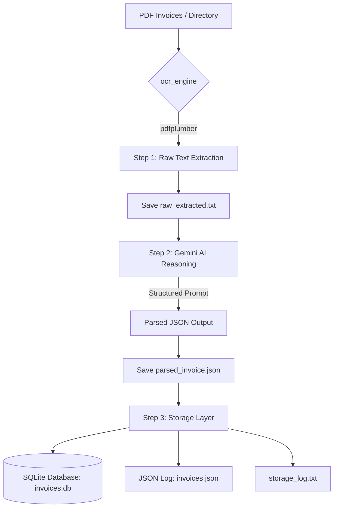

# Gemini Invoice Parser

This tool extracts structured data from PDF invoices using `pdfplumber` for text extraction and the Google Gemini API for intelligent field parsing.

## System Architecture


### Logical Workflow


## Setup

1.  **Dependencies**: Ensure you have the required libraries installed in your environment:
    ```bash
    pip install google-genai pdfplumber
    ```

2.  **API Key**: Set your Google API Key as an environment variable:
    ```bash
    # Windows (PowerShell)
    $env:GOOGLE_API_KEY = "your_api_key_here"
    
    # Linux/Mac
    export GOOGLE_API_KEY="your_api_key_here"
    ```

## Usage

You can process a single invoice or a whole directory of invoices:

### Single Invoice
```bash
python invoice_parser.py path/to/your/invoice.pdf
```

### Multiple Invoices (Batch Processing)
```bash
python invoice_parser.py path/to/invoice_folder/
```

### Viewing Stored Data
To see a list of all parsed invoices in the SQLite database:
```bash
python view_db.py
```

To see detailed info (including line items) for a specific invoice ID:
```bash
python view_db.py <ID>
```

## How it works

1.  **Multiple Processing Pipeline**: The script detects if you provided a file or a folder. If it's a folder, it automatically iterates through every PDF file it finds.
2.  **Organized Output**: For every processed invoice, a `results_<filename>` directory is created.
3.  **Step-by-Step Results**:
    -   `step_1_ocr/`: Raw text from `pdfplumber`.
    -   `step_2_llm/`: Structured JSON from Gemini.
    -   `step_3_storage/`: Confirmation of database/JSON storage.
4.  **Global Storage**: All results are also appended to a global `invoices.json` and `invoices.db` (SQLite) for easy reporting.
